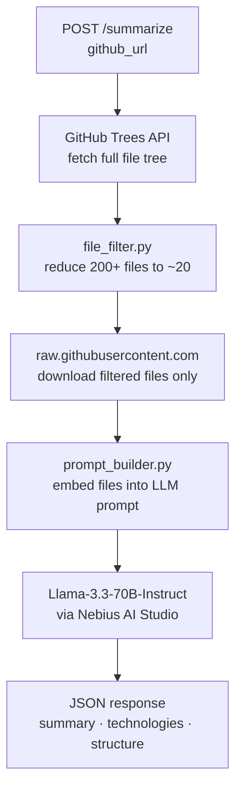

# GitHub Repository Summarizer


A FastAPI service that analyzes any public GitHub repository and returns a structured JSON summary using `Llama-3.3-70B-Instruct`. Point it at any repo URL — it intelligently filters the files, builds a context-aware prompt, and returns a structured summary in seconds.

> Demonstrates: REST API design, LLM prompt engineering, intelligent file filtering, structured JSON output, and production-ready FastAPI patterns.

---

## Results at a Glance

| Metric                              | Value                        |
|-------------------------------------|------------------------------|
| Input                               | Any public GitHub repo URL   |
| Output                              | Structured JSON (3 fields)   |
| Files processed per repo            | ~20–30 (filtered from 200+)  |
| Model                               | Llama-3.3-70B-Instruct       |
| Avg. response time                  | ~5–10 seconds                |
| Interactive docs                    | Swagger UI at `/docs`        |

---

## What It Does

Send a GitHub URL → get back a JSON summary with:
- `summary` — what the project does and its purpose
- `technologies` — languages, frameworks, and tools detected
- `structure` — directory layout and main components

---

## Pipeline



---

## Sample Output

**Request:**
```bash
curl -X POST http://localhost:8000/summarize \
  -H "Content-Type: application/json" \
  -d '{"github_url": "https://github.com/SharahovichDani/github-summarizer"}'
```

**Response:**
```json
{
  "summary": "A FastAPI service that analyzes public GitHub repositories using an LLM. It fetches the repo file tree, filters down to the most relevant source files, and returns a structured summary including purpose, technologies, and architecture.",
  "technologies": ["Python", "FastAPI", "Uvicorn", "OpenAI SDK", "Nebius AI Studio", "python-dotenv"],
  "structure": "app/main.py — FastAPI entry point and /summarize endpoint. app/github_client.py — fetches repo tree and file contents. app/file_filter.py — rule-based file selector. app/prompt_builder.py — constructs the LLM prompt. app/nebius_client.py — LLM API wrapper."
}
```

---

## Quick Start

```bash
git clone https://github.com/SharahovichDani/github-summarizer
cd github-summarizer
python -m venv venv

# Windows
venv\Scripts\activate
# macOS / Linux
source venv/bin/activate

pip install -r requirements.txt
```

Get a free Nebius AI Studio key at [studio.nebius.ai](https://studio.nebius.ai/), then set it:

```bash
cp .env.example .env
# Edit .env and add your key: NEBIUS_API_KEY=your_key_here
```

Start the server:

```bash
uvicorn app.main:app --reload
```

Open **http://localhost:8000/docs** for the interactive Swagger UI — click `POST /summarize` → Try it out → paste any GitHub URL → Execute.

---

## Model: `meta-llama/Llama-3.3-70B-Instruct`

| Property | Detail |
|---|---|
| **Why Instruct?** | Fine-tuned to follow instructions and return strict JSON — smaller models hallucinate structure |
| **Why 70B?** | Deep code comprehension across multi-file repos; 8B models are unreliable on JSON schema adherence |
| **Cost** | $0.13 input / $0.40 output per million tokens — ~10× cheaper than GPT-4o for equivalent quality |

---

## File Filtering — How 200+ Files Become ~20

A typical repository has 200–500+ files. Sending everything to an LLM hits context limits and wastes tokens on irrelevant content. `file_filter.py` reduces this intelligently:

| Rule | What it does |
|---|---|
| Skip junk folders | Ignores `tests/`, `node_modules/`, `dist/`, `.github/`, etc. |
| Always include priority files | `README.md`, `package.json`, `pyproject.toml`, `Dockerfile`, `Makefile` |
| Include source code (dynamic cap) | `.py`, `.js`, `.ts`, `.go`, `.rs` — cap scales with repo size (15–20 files) |
| Skip binary/media/lock files | Images, fonts, `package-lock.json`, compiled files |
| Skip files > 100KB | Prevents single oversized files from flooding the context |
| Hard cap at 30 files | Final safety limit on context window usage |

Files longer than 8,000 characters are truncated with `... [truncated]` in the prompt.

---

## Key Findings

- **Filtering is the hardest part.** Getting the right 20 files from 300+ determines output quality more than prompt wording.
- **Structured JSON output requires 70B+.** Smaller models frequently break the schema or add markdown formatting around the JSON.
- **Priority file inclusion matters.** `README.md` + entry points give the LLM the framing it needs to accurately interpret the rest.

---

## Limitations & Future Work

- **No authentication.** Private repos are not supported — GitHub token support would be a natural next step.
- **No caching.** Repeated requests for the same repo re-fetch and re-summarize. A Redis cache keyed on repo URL + last commit SHA would fix this.
- **No streaming.** The full response waits for the LLM to finish. Streaming the JSON token-by-token would improve perceived latency.
- **Single model, no fallback.** If Nebius is unavailable, the request fails. A fallback to a smaller model would improve reliability.
- **Rate limiting.** No per-IP throttling — a public deployment would need this to prevent abuse.

---

## Concepts Demonstrated

- REST API design with FastAPI
- LLM prompt engineering for structured JSON output
- Intelligent file filtering (rule-based, context-aware)
- GitHub API integration (Git Trees + raw content)
- Environment variable management with `python-dotenv`
- Interactive API documentation via Swagger UI

**Stack:** Python 3.10+ · FastAPI · Uvicorn · OpenAI-compatible SDK · Nebius AI Studio · python-dotenv

---

## License

MIT — see [LICENSE](LICENSE).
